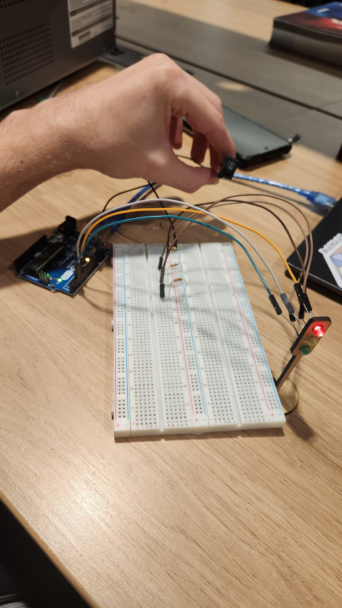

# Ponderada de Marcelo Rossignolli

## Parte 1: Montagem Física do Semáforo 

Você deve realizar a montagem física de um semáforo utilizando LEDs e resistores em
uma protoboard. Os LEDs devem representar as cores vermelho, amarelo e verde,
seguindo o esquema de um semáforo convencional.

Para completar esta etapa:
- Conecte corretamente os LEDs e resistores na protoboard conforme o esquema.
- Certifique-se de usar os resistores adequadamente para proteger os LEDs.
- Organize a disposição dos fios para garantir clareza e facilidade de visualização.


### Foto

<div align="center">
<sub>Figura 1 - Foto do circuito</sub>

<sup>Fonte: Material produzido pelo autor (2024)</sup>
</div>

Foram utilizados:
- 1x arduíno UNO
- 3x resistores
- 6x fios macho-fêmea
- 2x fios macho-macho
- 3x leds (Vermelho, Amarelo, Verde)
- 1x interruptor

## Parte 2: Programação e Lógica do Semáforo 

Você deve programar o comportamento do semáforo para alternar entre as fases
vermelho, amarelo e verde, seguindo a lógica abaixo:
- 6 segundos no vermelho
- 2 segundos no amarelo
- 2 segundos no verde
- +2 segundos no verde (simulando um tempo adicional para pedestres terminarem a
travessia)
- 2 segundos no amarelo
Esse ciclo deve ser repetido continuamente em um loop.

Ir além:

- Adicionar um componente para ligar e desligar o semáforo. Exemplos: sensor de
distância, sensor de luminosidade, botão etc.

- E/ou usar ponteiros na programação do semáforo;

### Vídeo

[Aqui](loopSemaforo.mp4)

### Código

```cpp

const int ledVermelho = 6; // Pino do LED vermelho
const int ledAmarelo = 4;  // Pino do LED amarelo
const int ledVerde = 3;    // Pino do LED verde

void setup() {
  // Configuração dos pinos como saídas
  pinMode(ledVermelho, OUTPUT);
  pinMode(ledAmarelo, OUTPUT);
  pinMode(ledVerde, OUTPUT);

  digitalWrite(ledVermelho, LOW);
  digitalWrite(ledAmarelo, LOW);
  digitalWrite(ledVerde, LOW);
}

void loop() {

  // 1.   
  digitalWrite(ledVermelho, HIGH);
  delay(6000); 
  digitalWrite(ledVermelho, LOW);
  
  // 2. Amarelo por 2 segundos
  digitalWrite(ledAmarelo, HIGH);
  delay(2000); 
  digitalWrite(ledAmarelo, LOW);
  
  // 3. Verde por 4 segundos (2 + 2 segundos para pedestres)
  digitalWrite(ledVerde, HIGH);
  delay(4000); 
  digitalWrite(ledVerde, LOW);
  
  // 4. Amarelo por mais 2 segundos
  digitalWrite(ledAmarelo, HIGH);
  delay(2000); 
  digitalWrite(ledAmarelo, LOW);
}


```

## Avaliação de Pares

### Avaliador: Kethlen Martins da Silva

| Critério                                                                                                 | Contempla (Pontos) | Contempla Parcialmente (Pontos) | Não Contempla (Pontos) | Observações do Avaliador |
|---------------------------------------------------------------------------------------------------------|--------------------|----------------------------------|--------------------------|---------------------------|
| Montagem física com cores corretas, boa disposição dos fios e uso adequado de resistores                | Até 3              | Até 1,5                            | 0                        | Os fios têm cores que facilitam o entendimento (marrom = GND, etc), e a montagem foi feita corretamente. 3,0                         |
| Temporização adequada conforme tempos medidos com auxílio de algum instrumento externo                  | Até 3              | Até 1,5                          | 0                        | A temporização está correta entre 6s, 2s e 4s.  3,0                        |
| Código implementa corretamente as fases do semáforo e estrutura do código (variáveis representativas e comentários) | Até 3              | Até 1,5                          | 0                        |            As fases do semáforo foram implementadas corretamente no código e as variáveis e comentários são fáceis de entender. 3,0             |
| Extra: Implementou um componente de liga/desliga no semáforo e/ou usou ponteiros no código | Até 1              |  Até 0,5                         | 0                        |  Marcelo utilizou um interruptor para fazer o liga-desliga do semáforo corretamente. 1,0                        |
|  |                                                             |  | |**Pontuação Total: 10**|


### Avaliador: Ian Pereira Simão

| Critério                                                                                                 | Contempla (Pontos) | Contempla Parcialmente (Pontos) | Não Contempla (Pontos) | Observações do Avaliador |
|---------------------------------------------------------------------------------------------------------|--------------------|----------------------------------|--------------------------|---------------------------|
| Montagem física com cores corretas, boa disposição dos fios e uso adequado de resistores                | Até 3              | Até 1,5                            | 0,25                        | A montagem física apesar de não utilizar as cores usuais, utiliza color coding da maneira correta para identificar cada porta, muito bem organizado, parabéns! |
| Temporização adequada conforme tempos medidos com auxílio de algum instrumento externo                  | Até 3              | Até 1,5                          | 0                        | os tempos de cada etapa do semáforo estão corretos. |
| Código implementa corretamente as fases do semáforo e estrutura do código (variáveis representativas e comentários) | Até 3              | Até 1,5                          | 0                        | o código implementa corretamente as fases e delay de cada cor do semáforo. |
| Extra: Implmeentou um componente de liga/desliga no semáforo e/ou usou ponteiros no código | Até 1              |  Até 0,5                         | 0                        | Implementou corretamente o componente liga e desliga, fazendo de forma adequada o circuito do semáforo que é desligado completamente ao apertar o swtich. |
|  |                                                             |  | |**Pontuação Total: 9,75**|
